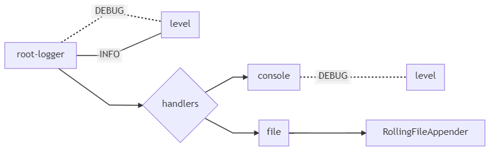
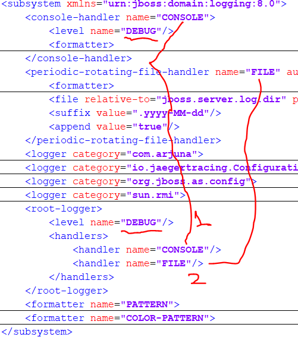
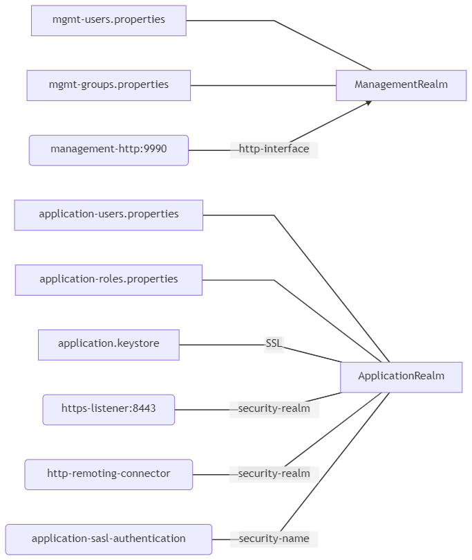

## Q A. I want to change log level in wildfly, by default its printing only INFO level.

Answer you should change LOG level in standalone.xml

#### subsystem>profile>logging:8.0

[Onine graph editor link](https://mermaid-js.github.io/mermaid-live-editor)

[Mermaid diagram code file ](diagram_mermaid_code.txt)
  
 **object diagram**

**xml screenshot**

##### Before changing the LOG level
	14:45:06,424 INFO  [org.jboss.as.mail.extension] (MSC service thread 1-1) WFLYMAIL0002: Unbound mail session [java:jboss/mail/Default]
	14:45:06,433 INFO  [org.wildfly.extension.undertow] (MSC service thread 1-8) WFLYUT0008: Undertow HTTP listener default suspending
	14:45:06,429 INFO  [org.wildfly.extension.undertow] (MSC service thread 1-7) WFLYUT0008: Undertow HTTPS listener https suspending
	14:45:06,445 INFO  [org.jboss.as.connector.deployers.jdbc] (MSC service thread 1-5) WFLYJCA0019: Stopped Driver service with driver-name = h2

##### After changing the LOG level
	18:47:18,868 DEBUG [org.apache.activemq.artemis.core.server.impl.QueueImpl] (Thread-2 (ActiveMQ-server-org.apache.activemq.artemis.core.server.impl.ActiveMQServerImpl$6@36bbc347)) Scanning for expires on jms.queue.DLQ done
	18:47:48,876 DEBUG [org.apache.activemq.artemis.core.server.impl.QueueImpl] (Thread-4 (ActiveMQ-server-org.apache.activemq.artemis.core.server.impl.ActiveMQServerImpl$6@36bbc347)) Scanning for expires on jms.queue.DLQ
	18:47:48,876 DEBUG [org.apache.activemq.artemis.core.server.impl.QueueImpl] (Thread-4 (ActiveMQ-server-org.apache.activemq.artemis.core.server.impl.ActiveMQServerImpl$6@36bbc347)) Scanning for expires on jms.queue.DLQ done

## Q B. I want to know how many realms are there how to configure them ?

**Flow Diagram**

	

