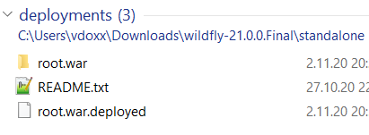
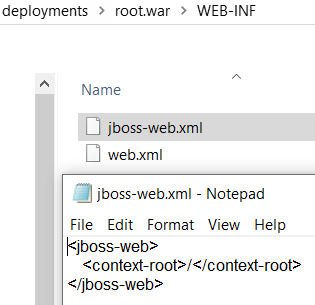
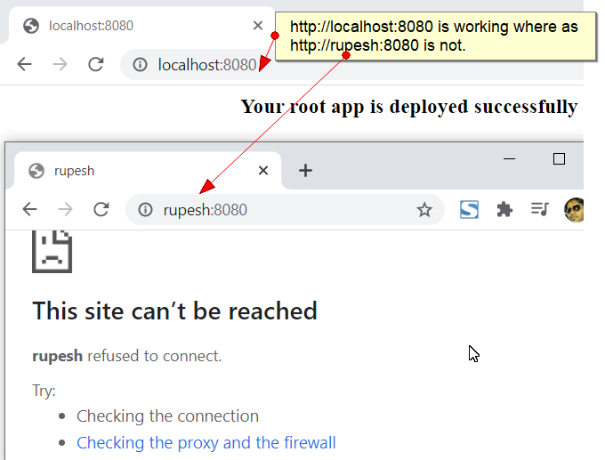
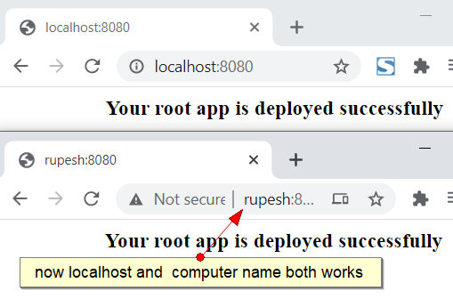
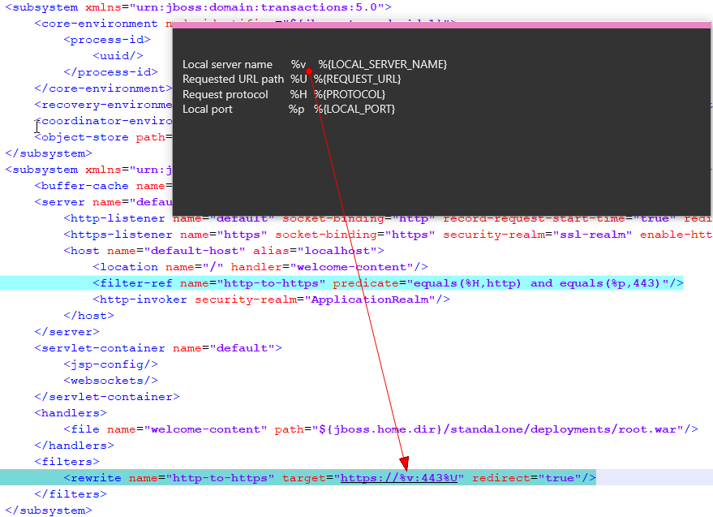

## Q A. I want to change log level in wildfly, by default its printing only INFO level.

Answer you should change LOG level in standalone.xml

#### subsystem>profile>logging:8.0
  
 **object diagram**


**xml screenshot**


##### Before changing the LOG level
	14:45:06,424 INFO  [org.jboss.as.mail.extension] (MSC service thread 1-1) WFLYMAIL0002: Unbound mail session [java:jboss/mail/Default]
	14:45:06,433 INFO  [org.wildfly.extension.undertow] (MSC service thread 1-8) WFLYUT0008: Undertow HTTP listener default suspending
	14:45:06,429 INFO  [org.wildfly.extension.undertow] (MSC service thread 1-7) WFLYUT0008: Undertow HTTPS listener https suspending
	14:45:06,445 INFO  [org.jboss.as.connector.deployers.jdbc] (MSC service thread 1-5) WFLYJCA0019: Stopped Driver service with driver-name = h2

##### After changing the LOG level
	18:47:18,868 DEBUG [org.apache.activemq.artemis.core.server.impl.QueueImpl] (Thread-2 (ActiveMQ-server-org.apache.activemq.artemis.core.server.impl.ActiveMQServerImpl$6@36bbc347)) Scanning for expires on jms.queue.DLQ done
	18:47:48,876 DEBUG [org.apache.activemq.artemis.core.server.impl.QueueImpl] (Thread-4 (ActiveMQ-server-org.apache.activemq.artemis.core.server.impl.ActiveMQServerImpl$6@36bbc347)) Scanning for expires on jms.queue.DLQ
	18:47:48,876 DEBUG [org.apache.activemq.artemis.core.server.impl.QueueImpl] (Thread-4 (ActiveMQ-server-org.apache.activemq.artemis.core.server.impl.ActiveMQServerImpl$6@36bbc347)) Scanning for expires on jms.queue.DLQ done

## Q B. I want to know how many realms are there how to configure them ?

**Flow Diagram**


## Q C. How to disable default web-app in wildfly ?

comment out below tag to disable welcome-content.

```html
 <!-- <location name="/" handler="welcome-content"/>-->
  
```
To replace this page simply deploy your own war with / as its context path.
To disable it, remove the "welcome-content" handler for location / in the undertow subsystem.

## Q D. How to enable exploded app deployment ?

Search for subsystem > deployment-scanner tag in file once found, the add **auto-deploy-exploded="true"** parameter into it.

	<!-- Adding auto-deploy-exploded=true parameter to enable auto deployment of exploded war,jar or ear files -->
	<!-- <deployment-scanner path="deployments" relative-to="jboss.server.base.dir" scan-interval="5000" runtime-failure-causes-rollback="${jboss.deployment.scanner.rollback.on.failure:false}"/>-->
	<deployment-scanner path="deployments" relative-to="jboss.server.base.dir" scan-interval="5000" auto-deploy-exploded="true" runtime-failure-causes-rollback="${jboss.deployment.scanner.rollback.on.failure:false}"/>
		 

## Q E. How to deploy your app in root context (/) ?

Add jboss-web.xml file beside web.xml file with below content.
```xml
	<jboss-web>
	   <context-root>/</context-root>
	</jboss-web>
```

	
	 

## Q A. How to bind jboss to computer name instead of ip/ how to access jboss server with remote computer name ?

```xml
	<!-- commenting below lines to bind it with machine name -->
	<!-- <inet-address value="${jboss.bind.address:127.0.0.1}"/> -->
	<inet-address value="${jboss.bind.address:0.0.0.0}"/>
```

**Before binding to 0.0.0.0**


**After binding to 0.0.0.0**



## Q F. How to add custom queue in wildfly ?

Add your queue entry under <server/profile/subsystem xmlns="urn:jboss:domain:messaging-activemq

	<jms-queue name="ExpiryQueue" entries="java:/jms/queue/ExpiryQueue"/>
	
## Q G. How to redirect from http to https

	<subsystem xmlns="urn:jboss:domain:undertow:9.0" default-server="default-server" default-virtual-host="default-host" default-servlet-container="default" default-security-domain="other" statistics-enabled="${wildfly.undertow.statistics-enabled:${wildfly.statistics-enabled:false}}">
            <buffer-cache name="default"/>
            <server name="default-server">
                <http-listener name="default" socket-binding="http" record-request-start-time="true" redirect-socket="https" enable-http2="true"/>
                <https-listener name="https" socket-binding="https" security-realm="ssl-realm" enable-http2="true"/>
                <host name="default-host" alias="localhost">
                    <location name="/" handler="welcome-content"/>
                    <!--<filter-ref name="http-to-https" predicate="equals(%H,http) and equals(%p,443)"/> this line also works-->
					<filter-ref name="http-to-https" predicate="equals(%{PROTOCOL},http) and equals(%{LOCAL_PORT},80)"/>
                    <http-invoker security-realm="ApplicationRealm"/>
                </host>
            </server>
            <servlet-container name="default">
                <jsp-config/>
                <websockets/>
            </servlet-container>
            <handlers>
                <file name="welcome-content" path="${jboss.home.dir}/standalone/deployments/root.war"/>
            </handlers>
            <filters>
                <!--<rewrite name="http-to-https" target="https://%v:443%U" redirect="true"/> this line also works-->
				<rewrite name="http-to-https" target="https://%{LOCAL_SERVER_NAME}:443%{REQUEST_URL}" redirect="true"/>
            </filters>
    </subsystem>
	


	
reference links
https://serverfault.com/questions/969928/wildfly-http-to-https-redirect-on-the-same-port
https://support.squoring.com/documentation/18.0.1/install_admin_manual/sect_securing_https_redirect.html
https://undertow.io/undertow-docs/undertow-docs-2.0.0/predicates-attributes-handlers.html
		
#### Reference
 
[Onine graph editor link](https://mermaid-js.github.io/mermaid-live-editor)

[Mermaid diagram code file ](diagram_mermaid_code.txt)
	

